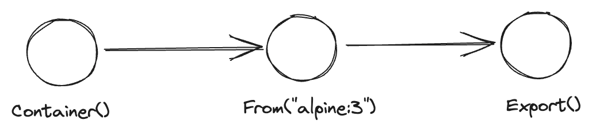
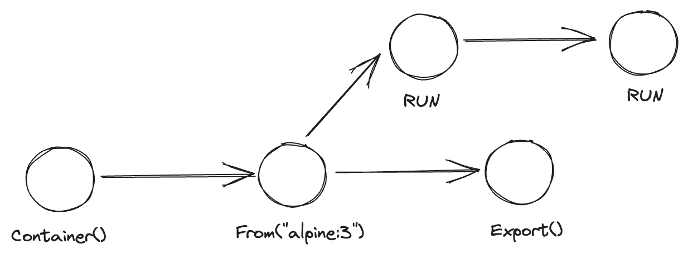
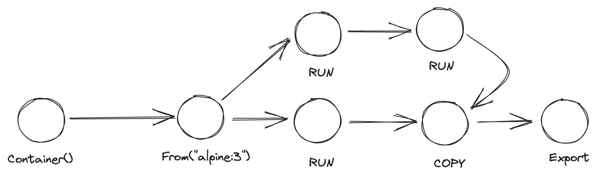
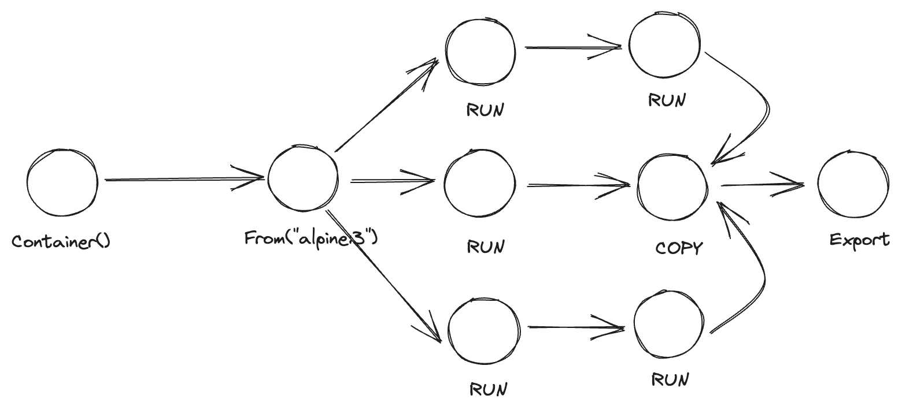

# Dagger

dagger is a CI/CD Code that Runs Anywhere. It has a couple of SDKs in different programming languages, which is in a nutshell a GraphQL client.

# The Concept

In dagger, most methods create a `directed acyclic graph` which is required to remember when you working with the dagger. It is very powerful thinking as it builds a couple of concepts

- Caching
- Isolation
- Parallelization



## Caching

Because most actions in Dagger created a node in the graph, their reference can be saved into a variable and be a starting point for another operation. This enables caching as there is no need to start over to build all the operations that lead to that node.



## Isolation

Because most actions in Dagger create a node, It can always be possible to diverge the node to a different direction and perform some actions, store the results and come back and resume the original operation. Also, each node will be executed as an isolated command on the Docker engine.



## Parallelization

One of the advantages of using `directed acyclic graph` is, that there are no directed cycles. This enables the engine to perfom topological sort to perform all the operations in serial or parallel. So technically, the developers don't need to explicitly define multi-thread design to speed things up on their CI/CD pipeline.



# Dockerfile

There is a direct translation between commands in Docker file and Dagger's sdk.

| Dockerfile    | Golang SDK                    |
| ------------- | ----------------------------- |
| FROM alpine:3 | From("alpine:3")              |
| COPY          | WithFile() or WithDirectory() |
| RUN           | WithExec()                    |
| ENV           | WithEnvVariable()             |
| WORKDIR       | WithWorkDir()                 |
| ENTRYPOINT    | WithEntrypoint()              |
| USER          | WithUser()                    |
| LABEL         | WithLabel()                   |

# Examples

## Export a docker image as a file

```golang
ctx := context.Background()
client, err := dagger.Connect(ctx, dagger.WithLogOutput(os.Stdout))
if err != nil {
    panic(err)
}

// Asking the host for getting the path to current directory
src := client.Host().Directory(".")

// creating an empty container, using alpine:3 as base and export
// the image to current directory as a gzip file
client.Container().From("alpine:3").Export(ctx, "./sample.tar.gz")
```

## Parallelization

```golang
ctx := context.Background()
client, err := dagger.Connect(ctx, dagger.WithLogOutput(os.Stdout))
if err != nil {
    panic(err)
}

img := client.Container().From("alpine:3")

c1 := img.WithExec([]string{"touch", "file1.txt"}).File("file1.txt")
c2 := img.WithExec([]string{"touch", "file2.txt"}).File("file2.txt")
c3 := img.WithExec([]string{"touch", "file3.txt"}).File("file3.txt")

ok, err := img.
    WithFile("./file1.txt", c1).
    WithFile("./file2.txt", c2).
    WithFile("./file3.txt", c3).
    Export(ctx, "./sample.tar.gz")
if err != nil {
    panic(err)
}

if !ok {
    panic("failed to export image")
}
```
